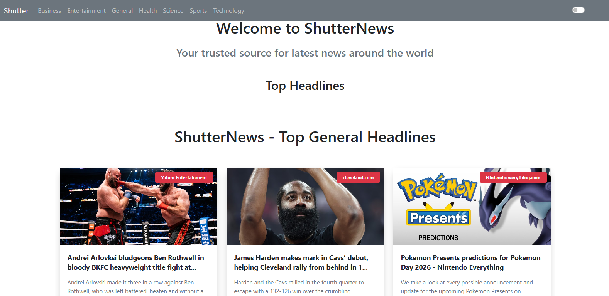
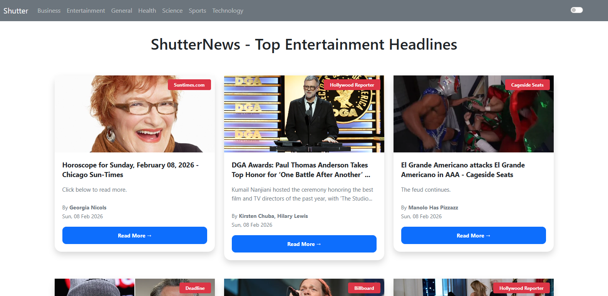
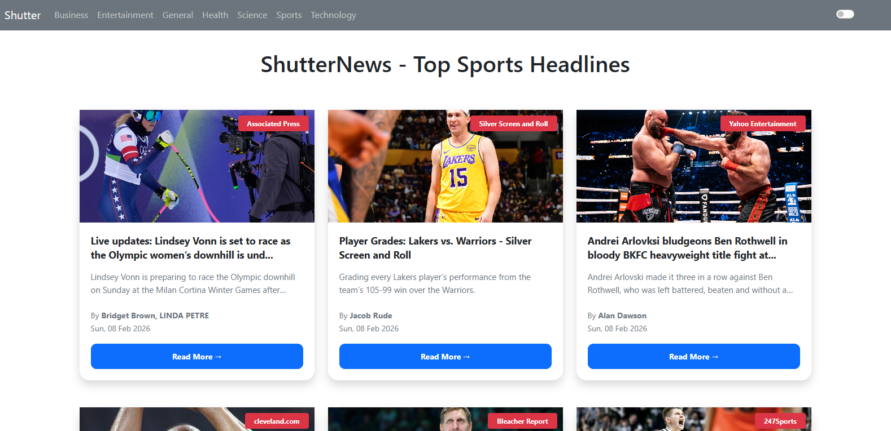

# Live News App - React + Bootstrap

A simple and modern **frontend-only** news application built with React.js and Bootstrap. It fetches and displays **live news** from a public API (NewsAPI.org) in real-time. No backend involved just pure frontend magic! 🚀

This project was built to practice API integration, responsive design with Bootstrap, and state management in React.

## 📦 Technologies Used
- React.js (Create React App)
- Bootstrap 5 (for responsive UI and components)
- Axios (for API calls)
- NewsAPI.org (free news data source)

## 🦄 Features
Here's what you can do in the app:

- View **live top headlines** from around the world
- Browse news by **categories** (Business, Technology, Sports, Entertainment, etc.)
- Search for specific news topics
- Responsive design works great on mobile, tablet, and desktop thanks to Bootstrap
- Loading spinner while fetching data
- Error handling for API issues
- Clean card-based layout for news articles (title, image, description, source, date)

## 🎯 How it Works
1. On load, the app fetches top headlines from NewsAPI.
2. News is displayed in Bootstrap cards with images, titles, summaries, and "Read More" links.
3. Category buttons or search bar trigger new API calls.
4. All data is fetched client-side no server needed!

## 👩🏽‍🍳 The Process & What I Learned
Started with setting up React + Bootstrap for quick responsive layout.

Focused on:
- API integration with Axios (handling async data with useEffect)
- Managing state for loading, error, and news articles
- Creating reusable components (NewsCard, CategoryButtons)
- Making the UI clean and user-friendly with Bootstrap grid and cards
- Practicing conditional rendering (loading spinner, no results message)

This project helped me get comfortable with real-world API usage and frontend data fetching.

## 🚦 Running the Project Locally
1. Run npm install or yarn in the project directory to install the required dependencies.
2. Run npm run start or yarn start to get the project started.
## Screenshots

## Screenshots

### Main Page (Top Headlines)

### Entertainment News

### Sports News

### Technology News

